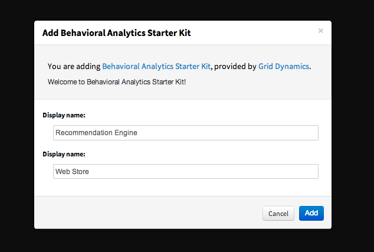

Chapter 2: Getting Started
===========================
In this chapter we’ll perform all configuration and set-up steps necessary to get our starter kit up running. Along the way we’ll introduce basic concepts of Qubell Adaptive PaaS technology used by managing all aspects of deployment and management of your recommendation engine.

In order to start working with the starter kit, you need to perform the following steps:
- Set-up your Qubell account
- Import Behavioral Analytics Starter Kit 
- Set-up Amazon account
- Configure deployment environment

Let’s walk through these three steps in details. 

Set-up Qubell Account
---------------------
To open a free account on Qubell, please go to [Qubell.com](http://qubell.com/) and click on “Sign Up” from the top menu. Follow the instructions to create an account. If you have an account, skip this step. 

If your screen looks similar to the image below, volla! You are inside the user portal of Qubell Adaptive PaaS. We are going to use this portal extensively while we work with the Kit. 

Although we’ll inject detailed instructions on how to use Qubell for all standard functions of the starter kit, you may want to take a minute to familiarize yourself with Qubell Adaptive PaaS technology. Here is a quick reference guide:
- [Core concepts](http://docs.qubell.com/concepts/contents.html)
- [Manifest developer’s guide](http://docs.qubell.com/developer/contents.html)
- [Action reference](http://docs.qubell.com/actions/contents.html)
- [API 1.3 reference](http://docs.qubell.com/api/contents.html)
- [Administrator’s guide](http://docs.qubell.com/admin/contents.html)

Import Behavioral Analytics Kit
-----------------------------
Now that you have the account on Qubell, let’s import the content of the Starter Kit into your Qubell portal. This Starter Kit is published on Qubell web site, amongst other starter kits.
- Go to [http://qubell.com/starter-kits/BASK](http://qubell.com/starter-kits/BASK)
- Click “Get It Now” 

- Login to Qubell

- Provide the following values to the fields to add your two applications to the platform:
  - Display name: Recommendation Engine
  - Display name: Web store 
  

Congratulations, you have successfully imported the elements of the starter kit into your account. To verify, you should see two applications on your Application tab:

You are almost ready to launch your applications, as soon as you provide and configure a physical environment for the applications to run on. This kit is developed to run on Amazon EC2 and S3 cloud services, so an Amazon account is necessary. Later, we will discuss how to customize this kit so that it can run on any infrastructure, including another public cloud, a private cloud or even bare metal servers in your datacenter. 

Set-up Amazon account
---------------------
Since you’ll be deploying the analytics and sample web store on Amazon cloud, you need to have an Amazon account, configure its security group to allow traffic to your applications, and add that Amazon account to your Qubell portal. 
- **Obtain Amazon EC2 account capable of creating EC2 nodes and using S3 service.** If you don’t yet have an account on Amazon, it can be done here. If you already have one, move to the next step.
- **Set-up security group.** The EC2 security group “default” has to allow connections to the application you’ll be deploying using your account. Below is the list of ports that have to be open for each application or service using the [Amazon portal](http://docs.aws.amazon.com/AWSEC2/latest/UserGuide/using-network-security.html#adding-security-group-rule): 
  - 22 (TCP, SSH)
  - 80 (TCP, HTTP of httpd)
  - 443 (TCP, НTTPS of httpd)
  - 8080 (TCP, Tomcat)
  - 8649 (TCP and UDP, Ganglia)
  - 8020 (TCP, NameNode DFS)
  - 50070 (TCP, HTTP of NameNode WebUI)
  - 8021 (TCP, JobTracker)
  - 50030 (TCP, HTTP of JobTracker WebUI)
  - 50010 (TCP, DataNode DFS)
  - 50020 (TCP, DataNode IPC)
  - 50075 (TCP, HTTP of DataNode WebUI)
  - 50060 (TCP, HTTP of TaskTracker WebUI)

Introduction to Qubell Platform Concepts
----------------------------------------
Before we go any further, let’s understand how application deployment happens in Qubell. Qubell is designed to make it easy for developers to deploy complex distributed applications - multi-tiered web stores or Hadoop clusters - for different purposes, such as development, testing and production. 
  Application is always deployed into some environment, such as dev, qa or production. Different environments may operate on different clouds, reside in different datacenters and use different services. Once the environment has been set-up, Qubell will take care that applications can be launched into any compatible environment. Compatibility between an application and an environment means that if that application requires a certain service, the environment must have a service available for the application. Qubell validates the compatibility of application and environment at launch. Services come in three types:
- **Cloud accounts-** These are a special type of service reserved for public cloud accounts, such as Amazon EC2 or Rackspace. If your application expects a cloud, it will not be deployed into an environment that doesn’t have one.
- **Markers-** These are a another special type of service that simply indicates whether some service is present in the environment. For example, “Mainframe connection” might be a marker that signals the availability of the mainframe end-point in a particular environment. 
- **Services-** These can be anything, from a pool of VMs to a database with customer records. We are going to use one service called Secure Vault. Secure Vault is an encrypted store that holds your private information such as Amazon credentials and SSH keys. This way applications can safely store, retrieve and use secret data. 

A platform is a central repository of definitions of services available across all environments. The lifecycle of a service starts by being added to the platform, then enabled in some environments as appropriate. 
  Besides different services, environments may have properties and policies. Both properties and policies look like key-value pairs defined for each environment, but they are used for different purposes:
- **Properties-** These are used by Qubell to store parameters necessary to complete application deployment, configuration and management. For example, “db_connection_string = jdbc://somewhere” is a parameter needed by the application to resolve the location of the database driver in this particular environment. We will use properties to pass the location of files stored on S3 between the web store and the analytic engine.
- **Policies-** These overwrite the values of parameters defined by the application. Different environments may impose different rules on the application. For example, while “test” environment may be configured to offer a choice of Ubuntu or CentOS for an operating system, the “production” environment may allow only RHEL. We are going to define a few policies related to the cloud account. 

It must be clear now that before any application can be launched, there has to be at least one environment set-up, and that environment ought to have all services required by the application.
Armed with theory, we are ready to configure our application deployment environment.  

Add Your Amazon Account to the Platform
---------------------------------------
After you have obtained your Amazon account along with its Amazon secret and access keys, you need to add your account to the platform. To do so, go to the subsection named "Cloud Accounts" under the tab "Platform." Press "Add a cloud account" button. 

Specify your account name, provider="Amazon EC2", AWS credentials and security group and press "Save."

Add Secure Vault Service to the Platform
----------------------------------------
To create a service vault, go to the the subsection named "Services" under the tab "Platform". "Press the "Add a service" button. 

Specify service name as "Service vault" (or a name of your own preference), choose "Secure Vault 2.0" for Type.

Create “Test” Environment
-------------------------
Now you are ready to add your testing environment. To do so, go to the "Environments" tab and click on the "Add an environment" button. 

Specify environment name as "Test" (or a name of your own preference) and press "Add." A new environment will be open. 

Add Amazon cloud to “Test” environment
--------------------------------------
To set connect your Amazon cloud account to your own environment, press "Set a cloud account" from the "Environments" tab. Choose previously created cloud account name. 

Add Secure Vault Service to “Test” Environment
----------------------------------------------
From the same "Environments" tab, press "Add a Service" to add your secure vault service to your own environment. Press the "Add a service" button. Select "Secure vault" and press "Add."

Generate and Store SSH Keys
---------------------------
To get, upload, or regenerate keys, go to the subsection "Services" under the tab "Platform." To upload keys, press "Edit," specify service name and press "Upload" button. To renegerate keys, press "Edit," and then "Regenerate" button. SSH Keys should appear.  (EXPLAIN SSH KEYS. DIFFERENCE BETWEEN UPLOAD/REGENERATE KEYS.)

Add S3 Bucket Property to “Test” Environment
------------------------------------
To add net environment property, press "Add property" button from the "Environments" tab. 

- Enter property name: "s3_bucket_name"
- Enter property type: "string"
- Enter property value: Name of your S3 bucket

Press the "Add" button to add your s3 bucket property. 

Add Policies to “Test” Environment
----------------------------------
There are two policies that need to be added to the environment: .s3manage.aws_access_key_id and .s3manage.aws_secret_access_key. Please note that the leading dot before "s3manage" is necessary!

To add .s3manage.aws_access_key_id, click "Add policy" from the "Environment" tab and enter the following parameters;
- When asked to execute: ".s3manage"
- Override value of: "aws_access_key_id"
- With: your Amazon Access Key ID.

To add .s3manage.aws_secret_access_key, again click "Add policy" from the "Environments" tab and enter the following parameters:
- When asked to execute: ".s3manage"
- Override value of: "aws_secret_access_key"
- With: your Amazon Secret Access Key.

Congratulations! You’ve successfully completed the set-up and ready to start using the Starter Kit.

**Next Chapter:** [Chapter 3- Working with the Web Store](Chapter%203.md)
