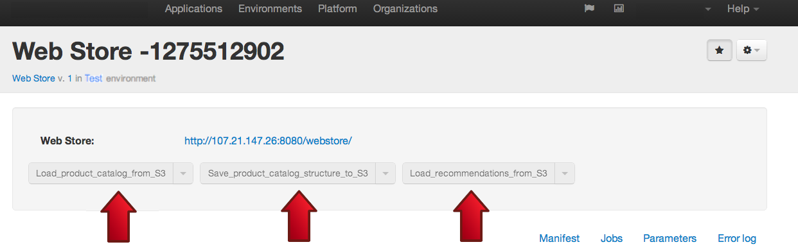

Chapter 3: Working with the Web Store
=====================================
What is Product Recommendation Engine?
-------------------------------------
Product recommendations are used by many web stores to persuade a customer who is about to buy an item to also buy other product(s) that goes well together. Product recommendation engines are amongst the most popular applications of customer behavioral analytics to eCommerce. Amazon.com has been using product recommendations brilliantly from the early days by showing the customer who placed X in the shopping cart that “those who bought X also bought Y and Z”. Many customers gladly go on to check out Y and Z and often buy them, too. 

Product recommendations are computed by mining the data in the historic purchases to identify frequently occurring patterns of products being bought together. We will explain methods of computing product recommendations  and show one that had been used in our kit in Chapter 3. In this chapter we’ll see how product recommendations are used in the web store once they were computed.

To see product recommendations in action
----------------------------------------
Let’s take a look at how product recommendations are used in our starter kit. First, let’s bring up a fresh copy of a web store by deploying it to our Test environment.

To launch Web Store:
--------------------
On Qubell portal, go to Applications -> Web Store -> Launch -> Advanced Launch. 

Set the input fields to the following values:
- Name: myStore
- Environment: Test
- Destroy in: 4 hours

Note: pre-scheduled destruction is a convenient feature during testing and experimentation to make sure you don’t create too many test instances of your application scattered across the cloud, eating away Amazon resources and your money for no reason. A discipline to schedule instance destruction at launch is important, unless you have a good reason to keep it around for much longer, which you can do by setting auto-destruction to “never”.

- Leave all other fields at defaults.

It should take about 10 minutes for the application to complete deploying. Once web store launches successfully you can see URL to web store web UI on application output panel.

If you failed to successfully launch the applications, please refer to our [Troubleshooting](https://docs.google.com/document/d/19H3Uujw54vJQlbgqc4XmZ7gWptDeNW0KZ9iOWq0dMXI/edit#) page, or return to Chapter 2 to reconfigure your settings. 

How does Qubell know how to deploy this Web Store?
--------------------------------------------------
When you push Launch button, Qubell executes a workflow associated with that command. The workflow can be found in the application manifest. This manifest came with the kit and can be found on Qubell portal here:

While it is possible to read the manifest to figure out what Qubell is doing, and we even encourage our users to do so, a detailed explanation of this manifest is outside of the scope of this introduction. Interested readers should refer to the [manifest developer guide](http://docs.qubell.com/developer/contents.html). 

Can I see what happened when my web store was launched?
-------------------------------------------------------
Qubell starts every workflow by creating an execution plan consisting of steps in the workflow, and then proceeds to executive that plan. You can always see a plan in real time under the table “Jobs” on Qubell portal. Once the job is complete, it will store the log of what happened for us to examine at any time. 

Navigate to Applications -> Web Store -> myStore and click on “Jobs” tab.

You will find a log of steps taken by Qubell in executing Launch workflow.  

My web store is up. How can I access it?
----------------------------------------
Once the web store successfully launched, you can start interacting with it. To find the URL of the store, check the link under “Web Store” shown on the myStore instance.

Go to that URL and you should see the web store.

As you may have guessed, this store URL was created dynamically for this particular instance of the store. You can launch another store at any time. When it comes up, you’ll get a different URL. Once an instance of the web store is destroyed, it’s public URL will become invalid. 

Working with Product Catalog and Product Recommendations
--------------------------------------------------------
We have created three utility functions to simplify working with different product catalogs and recommendations. Here they are:

You’ve seen the definition of these functions in the manifest for the store deployment. 
- **Load_product_catalog_from_S3:** this action is used to upload a new version of a catalog from S3. For example, the catalog used in this starter kit is not native to Broadleaf project. Instead, we used a demo product catalog from Magento, a popular open source eCommerce technology that you can find here. 
- **Save_product_catalog_structure_to_S3:** this actions puts the product information to S3 where the recommendation engine can pick it up. The engine doesn’t need a full catalog with prices and images; instead it needs to understand the structure of the catalog and the dependencies between products. We call a file with such information Product Catalog Structure file and you can find a default one here.
- **Load_recommendations_from_S3:** this action pulls newly computed recommendation file from S3 where recommendation engine stores it.

**Next Chapter:** [Chapter 4- Working with Recommendation Engine](Chapter%204.md)

