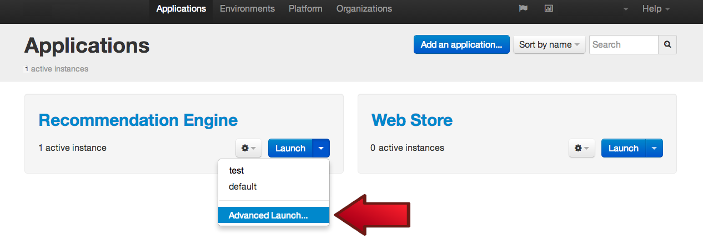
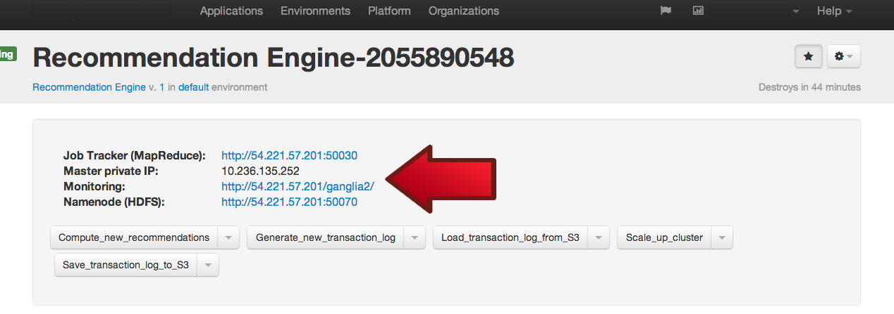

Chapter 4: Working with Recommendation Engine
=============================================
To Launch Recommendation Engine
-------------------------------
Let’s begin at looking at the recommendation engine by starting one up. Go to Applications ->Recommendation Engine -> Launch -> Advance Launch

Leave all fields at their default values, except three:
- Set name to myEngine
- Set environment to Test
- Set auto-destruction to 4 hours
- Set revision to blank
- Set slave quantify to 4, as a default

Press “Launch”. 

It should take about 20 minutes for the application to come up. Once the Hadoop cluster comes up successfully you can see it through the management tools and start working with it. Meanwhile, we’ll continue looking at the parts of the Recommendation Engine available to us. 

How This Recommendation Engine Works
------------------------------------
At a 10,000 foot view, this recommendation works in the following way. 

First, someone loads up on S3 a transaction log file. The transaction log file represents the historic purchases made by prior customers of the web store. The recommendation engine will find patterns in transaction log based the purchase history according to a certain distributed algorithm executed in the cluster. The result is a file stored in HDFS that contains recommendations. Once the recommendations are computed and stored in a file, they are copied from the local HDFS to S3, where our web store can pick them up. 

Now, unfortunately, getting access to real user transactions for a sample web store is quite impossible since the store is fake and no one is really shopping there. Fortunately, we have a generator of transaction logs based on product catalog structure and some configuration parameters. This generator was written by the analytics team in Grid Dynamics who wrote similar generators to some of their real eCommerce customers to be able to train and test their algorithms. The algorithm to produce the transaction log is also written as a Hadoop job. 

Default files can be found here:
- Transaction log
- Catalog structure
- Configuration file for transaction log
- Transaction log generator, in java
- Resulting transaction log
- Recommendation algorithm, in java
- Resulting recommendation file

Recommendation Engine Workflows
-------------------------------
To understand how this engine works, let’s look at the action workflows defined on it. You can always find the details of each action in the manifest. We are going to start with a very short overview of the actions, their purpose and implementation. The main sections of that manifest include:

**Launch:** as you might expect, this action starts up a cluster with one master and requested number of slave nodes. It will also configure the cluster to be monitored by an external tool, Ganglia, and start-up that tool.

**Scale_up_cluster:** this action will add a requested number of slave nodes to already existing cluster.

**Generate_new_transaction_log:** this action takes a product catalog structure file from HDFS, and a configuration file for the algorithm, runs a job to generate recommendations and stores the result in a transaction log file on stored again on HDFS.

**Save_transaction_log_to_S3:** this action moves the transaction log from HDFS to S3 for persistent storage. Note: in the real world, this file can be very large and moving it around might be quite slow and expensive. A different architecture would be needed if this was a truly large-scale log.

**Load_transaction_log_from_S3:** this action moves the transaction log from S3 to HDFS prior to computation of recommendations, if necessary.

**Compute_new_recommendations:** this action takes a transaction log from HDFS,and a configuration parameters for the algorithm, runs a job to generates recommendations and saves the results in the recommendation file on local HDFS and on S3.

This is the main job of the recommendation engine. More on how it works later.
- **Save_tansaction_log_to_S3:** this action will move the transaction log from Hadoop’s local HDFS to S3 to persist for future use. This is where Web Store will take it from
- **Load_transaction_log_from_S3:**

Main Algorithm: Recommendation generator
----------------------------------------
Recommendation processor is a java application that implements improved version of PFP-growth algorithm based on PFP-growth algorithm from Apache Mahout, a machine learning library. As a result, it extracts associative rules out of transaction logs and are presented as recommendations. It contains the set of algorithms that can work on top of Hadoop MapReduce. Following parameters should be provided to recommendation processor:
- minSupport- the minimal support level for PFP-growth algorithm. This means the minimal support N uses to select item sets that appeаrs in transaction log equal or more than N times. You should use minimal support value depending on your transaction log. With a small value, PFP-Growth will produce more association rules (many of them may mean nothing). With a large value, PFP-Grow will produce less rules (may also lose interesting rules). You can experiment with minimal support value to get statistically significant recommendations. Minimal support value is 3 by default.
- groups- the number of independent groups the transaction log will be split into. Separate FP-Growth will be launched for each group. The more data in the transaction log, the greater the number of groups is necessary to ensure that there is enough memory to handle a large group on a separate machine.

Recommendation processor consists of three map/reduce jobs, which are executed sequentially. So, the result of running of recommendation processor is association rules in form of dictionary, where the key is selected item(s) and the value is set of items usually purchased together with selected item(s). 

Supporting Algorithm: Transaction log generator
-----------------------------------------------
Transaction Log generator uses probabilistic customer behavior scenario, along with product categories and product ID names, to create a transaction log. The sample store extract product catalog information from previously uploaded product catalogues, which contain ID and names for product categories. For each user type you can set probability of shopping this user type and probability of buying product from particular category. You could also imitate customers behavior by modifying user type sceneries in configuration file.  

Hadoop Management Tools
-----------------------
We’ve integrated three popular tools that can be used to gain insight into the state of the Hadoop cluster. You can find them on the portal associated with a living instance of a cluster.

  - **Job tracker** shows (TBW)
  - **Monitoring** is done by a popular tool Ganglia (TBW)
  - **Namenode HDFS** - TBW

**Next Chapter:** [Chapter 5- Summary and What's Next?](Chapter%205.md)

