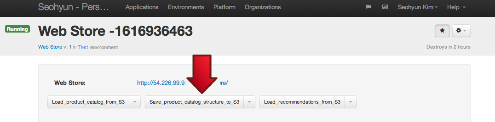

Chapter 5: Steps to See the Recommendations 
==========================================

This is a brief overview of the steps needed to see the recommendation products in action. You have already completed the first half of the steps. Now let's get started on the remaining steps.  

1) Put product catalog structure to S3
-------------------------------------
Once you have successfully loaded the product catalog from S3 to Web Store, press the "Save_product_catalog_structure_to_S3" button in Web Store to put product catalog structure from Web Store to your Amazon S3 bucket. Keep the default settings or you may change the S3 product catalog structure filename as you wish. Now product catalog structure will be uploaded to your private bucket on Amazon S3. 

2) Generate sample transaction log
-------------------------------
To generate a sample transaction log, you must first go to the Recommendation Engine application and click on the "Load_transaction_log_from_S3" button to load the transaction log. 

After the application has finished successfully launching that job, next click on the "Generate_new_transaction_log" to generate a sample transaction log. As a result, a transaction log generator job (LINK describing transaction log generator job) will be launched. Keep the default settings or you may change them (URLs to transaction log generator job and configuration file, and your Amazon S3 bucket and filename), as you wish.

3) Compute New Recommendation
-----------------------------
To computer new recoomendations, press the "Compute_new_recommendations" button from the Recommendation Engine application. This will launch the recommendation processor (LINK explaining recommendation processor) on the transaction log to get recommendations. 

Keep the default settings or you may change them as you wish. Further description on the parameters are explained here: (LINK)

4) Load Recommendations from S3
---------------------------
The final step to receiving the recommendations is to load the recommendations from S3 to the Web Store. To do so, go back to the Web Store applications and click the "Load_recommendations_from_S3" button. Keep the default settings, or if you have changed the filename previously, make sure it stays consistent. Congratulations, you can now see your starter kit in action!

5) To View Your Recommendations
----------------------------
To view your recommendations, open up the Web Store URL link located in the Web Store application. 

Buy any item, click on the shopping cart icon in the top right corner, and you should be able a number of related products that were chosen by the web store to convince you to buy more recommended products. 

How was this product recommendation module incorporated into the Web Store?
---------------------------------------------------------------------------
Product recommendations is a feature of a web store that can be added on to already functioning web store at any time. To demonstrate how this can be done,  we took an off-the-shelf open source web store framework Broadleaf that didn’t have product recommendations, and extended the store to have them. Specifically, we did the following things:
- Extended Web Store UI with simple product recommendation widget to render recommendations as a part of check-out UI.
- Extended web store back end to store product recommendations and find recommendations associated with a given set of selected products.
- Wrote an utility that loads recommendations from a file when recommendations are recomputed
The actual computation of recommendations happens outside of the web store and inside the analytics platform. The web store should only be concerned with using the recommendations that have been computed somewhere else.

Can I “play” with these action buttons or modify the web store’s source code to behave differently?
---------------------------------------------------------------------------------------------------
Of course you can- this is the point of this kit. Feel free to experiment with any of these buttons. As long as you don’t change any of the default values of parameters, the system should work correctly. If you decide to modify default parameters to point to a different S3 bucket, or use different files for catalog and/or recommendations - go ahead. Just keep in mind that debugging in not always easy and you are on your own. If you get stuck, please feel free to write to [BASK@griddynamics.com](mailto:BASK@griddyanmics.com) with your question and we’ll try to help. 

**Next Chapter:** [Chapter 6- Summary and What's Next?](Chapter%206.md)

